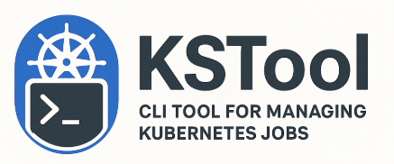

# KSTool

<p align="center">
  
</p>

KSTool is a terminal UI for managing Kubernetes Jobs. It lists jobs in a
namespace, lets you delete them, exec into their pods, view their manifests,
and create new ones from a templated YAML — all without leaving the terminal.

It ships with EIDF-flavoured defaults (namespace, user label, GPU list) but
every cluster-specific value lives in `~/.kstool/config.yaml`, so it works
against any cluster you can reach with `kubectl`.

## Features

- Async job dashboard: status, age, duration, pod count, GPU model and count.
- Filter by status (`all` / `running` / `failed` / `pending`) and owner
  (`all` / `mine`).
- Sort by age, duration, GPU count, or GPU type.
- Delete a job and exec into its pod, both gated on the `eidf/user`-style
  ownership label.
- View any job's live manifest read-only in `$EDITOR`.
- Create jobs from a templated YAML, with dropdowns for GPU product and
  priority class. Server-side `--dry-run` runs before the real apply.
- Save and reuse env-var presets under `~/.kstool/env_config_list/`.
- Structured audit log at `~/.kstool/kstool.log` (also best-effort to syslog).

## Requirements

- Go 1.21 or later (build only).
- A reachable Kubernetes cluster. KSTool tries in-cluster config first, then
  `$KUBECONFIG`, then `~/.kube/config`.
- An editor — defaults to `vim`, override via `$EDITOR`.

`kubectl` and `envsubst` are **not** required at runtime: KSTool talks to the
API directly with `client-go` and renders templates in pure Go.

## Install

```bash
git clone https://github.com/Suchun-sv/KSTool.git
cd KSTool
go build -o kstool ./cmd/kstool
./kstool
```

For a static binary that you can scp to a remote host:

```bash
CGO_ENABLED=0 go build -o kstool ./cmd/kstool
```

> Pre-built release tarballs will return once a v2 release tag is cut.

## Configuration

KSTool keeps everything under `~/.kstool/`. The directory and its contents
are created on first run with `0600`/`0700` permissions and atomic writes.

| Path | Purpose |
| --- | --- |
| `~/.kstool/config.yaml` | Tenancy: `namespace`, `user_label`, `gpu_products`, `priority_classes`, `base_template_url`. |
| `~/.kstool/base_apply.yaml` | Job template using `${VAR:-default}` placeholders. Downloaded once if missing. |
| `~/.kstool/env_config_list/<name>.yaml` | Saved env-var presets. Names must match `[A-Za-z0-9_.-]+`. |
| `~/.kstool/kstool.log` | Audit log of create / delete / exec actions. |

Example `config.yaml`:

```yaml
namespace: eidf029ns
user_label: eidf/user
gpu_products:
  - NVIDIA-H200
  - NVIDIA-H100-80GB-HBM3
  - NVIDIA-A100-SXM4-80GB
  - NVIDIA-A100-SXM4-40GB-MIG-3g.20gb
priority_classes:
  - default-workload-priority
  - batch-workload-priority
  - short-workload-high-priority
base_template_url: https://raw.githubusercontent.com/Suchun-sv/KSTool/main/config/base_apply.yaml
```

## Usage

### Job list keymap

| Key | Action |
| --- | --- |
| `↑` / `↓` | Move selection |
| `r` | Refresh (throttled to 2 s) |
| `f` | Cycle status filter: All → Running → Failed → Pending |
| `h` | Toggle "only my jobs" |
| `s` | Cycle sort: Age↓ → Age↑ → GPU#↑ → GPU#↓ → Dur↓ → Dur↑ → GPU Type↓ → GPU Type↑ |
| `d` | Delete the selected job (owner-checked, with confirmation) |
| `e` | Exec into the selected job's running pod |
| `c` | View the selected job's manifest in `$EDITOR` (read-only) |
| `n` | Open the create-job flow |
| `q` / `Esc` | Quit |

The status bar at the top reflects the current filter, owner toggle, and
sort. A `⟳` prefix indicates a refresh in flight.

### Create flow

`n` opens the saved-preset list:

1. Pick **Create new configuration** or an existing preset.
2. Edit env-vars in the form, or press `e` (focused on a button) to open the
   YAML in `$EDITOR` for bulk edits.
3. **Save** writes the preset to `~/.kstool/env_config_list/<name>.yaml`.
4. **Apply** renders the template, runs a server-side dry-run, then creates
   the Job. Errors from either step surface in a modal.

## Templating

The template engine recognises one form: `${VAR:-default}`. The first
occurrence's default wins, and braces are matched with depth so defaults can
contain `}` as long as they're balanced.

```yaml
metadata:
  generateName: ${USER:-default-user}-job-
spec:
  template:
    spec:
      containers:
        - image: ${IMAGE_NAME:-nvcr.io/nvidia/pytorch:23.12-py3}
          resources:
            limits:
              nvidia.com/gpu: ${GPU_NUM:-1}
      nodeSelector:
        nvidia.com/gpu.product: ${GPU_PRODUCT:-NVIDIA-H100-80GB-HBM3}
```

Notes:

- `USER` auto-fills with the current OS user.
- The literal substring `default-user` inside any default value is replaced
  with the current user, so `default-user-ws4` becomes `<you>-ws4`.
- `GPU_PRODUCT` and `PRIORITY_CLASS` render as dropdowns sourced from
  `config.yaml`.
- Bash-style `$pid` / `$!` (no `:-`) are left untouched, so container
  `args:` scripts survive intact.

A working template lives at [`config/base_apply.yaml`](config/base_apply.yaml).

## Development

```
cmd/kstool/                main entrypoint (wiring only)
internal/
  config/                  ~/.kstool layout, atomic IO, schema
  k8s/                     client-go wrapper (List/Get/Delete/Create/Exec)
  template/                pure-Go ${VAR:-default} extract + render
  tui/                     tview app, jobs view, create flow
  model/                   Job DTO, GPU parsing, filter/sort enums
  editor/                  $EDITOR shell-out
  log/                     slog + syslog audit log
```

Common commands:

```bash
go vet ./...
go test ./...
go build ./cmd/kstool
```

The `internal/template` package carries the bulk of the unit-test coverage.
TUI and k8s layers are manually validated against a kind/EIDF cluster.

## License

[MIT](LICENSE).
